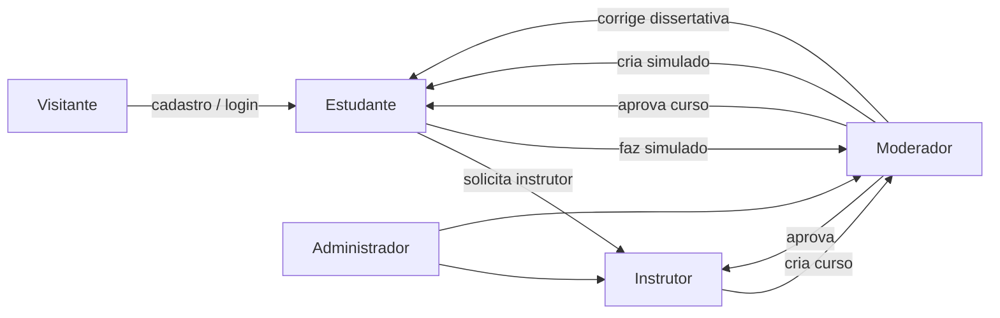

# Casos de uso

Documento de casos de uso da plataforma **Hexavante**, alinhado aos [requisitos funcionais](requisitos-funcionais.md), [regras de negócio](regras-de-negocio.md), [permissões](permissoes.md) e rotas implementadas no App Router.

Legenda de fase: **MVP** = escopo TCC | **P1** = diferencial implementado | **P2** = desejável | **F2** = Fase 2

---

## Atores

| Ator | Código | Descrição |
|------|--------|-----------|
| Visitante | — | Usuário não autenticado |
| Estudante | `USER` | Usuário autenticado com papel padrão |
| Instrutor | `INSTRUCTOR` | Cria e edita cursos após aprovação |
| Moderador | `MODERATOR` | Aprova instrutores, cursos e simulados; corrige dissertativas |
| Administrador | `ADMIN` | Herda capacidades de instrutor e moderador |

Um mesmo usuário pode acumular vários papéis (RN005). Nos fluxos abaixo, **Estudante** inclui qualquer usuário logado que execute ações de consumo de conteúdo.

---

## Convenção de descrição

Cada caso de uso segue o padrão:

| Campo | Significado |
|-------|-------------|
| **ID** | Identificador único (`UC###`) |
| **Ator** | Quem inicia o caso |
| **RF / RN** | Requisitos e regras relacionadas |
| **Pré-condições** | Estado mínimo antes do fluxo |
| **Fluxo principal** | Caminho feliz, numerado |
| **Fluxos alternativos** | Variações ou exceções relevantes |
| **Pós-condições** | Estado do sistema ao concluir com sucesso |
| **Rotas** | Páginas ou APIs envolvidas |

---

## Autenticação e perfil

### UC001 — Cadastrar conta

| | |
|---|---|
| **Ator** | Visitante |
| **RF / RN** | RF001, RN001–RN003 |
| **Fase** | MVP |

**Pré-condições:** visitante não possui conta na plataforma.

**Fluxo principal:**

1. Visitante acessa `/register`.
2. Informa e-mail, senha, nome de usuário e data de nascimento.
3. Sistema valida idade mínima de 13 anos (RN002) e unicidade do nome de usuário (RN003).
4. Sistema cria o usuário com papel `USER`.
5. Visitante é redirecionado para login ou área logada.

**Fluxos alternativos:**

- **1a.** E-mail ou nome de usuário já existente → sistema exibe erro e não cria a conta.
- **1b.** Idade inferior a 13 anos → cadastro bloqueado (RN002).

**Pós-condições:** usuário registrado e apto a autenticar-se.

**Rotas:** `/register`

---

### UC002 — Autenticar com e-mail e senha

| | |
|---|---|
| **Ator** | Visitante / Estudante |
| **RF / RN** | RF002 |
| **Fase** | MVP |

**Pré-condições:** conta existente com credenciais válidas.

**Fluxo principal:**

1. Usuário acessa `/login`.
2. Informa e-mail e senha.
3. Sistema valida credenciais via Auth.js.
4. Sessão é criada; usuário acessa área logada.

**Fluxos alternativos:**

- **3a.** Credenciais inválidas → mensagem de erro, sem sessão.

**Pós-condições:** sessão ativa com papéis do usuário carregados.

**Rotas:** `/login`

---

### UC003 — Autenticar com Google

| | |
|---|---|
| **Ator** | Visitante |
| **RF / RN** | RF001, RF003, RN001 |
| **Fase** | MVP |

**Pré-condições:** provedor OAuth Google configurado no ambiente.

**Fluxo principal:**

1. Usuário escolhe “Entrar com Google” em `/login`.
2. Sistema redireciona para o provedor Google.
3. Após consentimento, Auth.js cria ou vincula a conta.
4. Usuário retorna autenticado à plataforma.

**Pós-condições:** sessão ativa; conta criada na primeira autenticação, se necessário.

**Rotas:** `/login`, callback OAuth Auth.js

---

### UC004 — Recuperar senha

| | |
|---|---|
| **Ator** | Visitante / Estudante |
| **RF / RN** | RF005 |
| **Fase** | MVP |

**Pré-condições:** conta com e-mail cadastrado.

**Fluxo principal:**

1. Usuário acessa `/recuperar-senha` e informa o e-mail.
2. Sistema envia link de redefinição (quando SMTP configurado).
3. Usuário abre o link em `/redefinir-senha` e define nova senha.
4. Sistema atualiza a senha e invalida o token.

**Fluxos alternativos:**

- **2a.** E-mail não encontrado → mensagem genérica (sem revelar existência da conta).

**Pós-condições:** senha alterada; usuário pode autenticar com a nova credencial.

**Rotas:** `/recuperar-senha`, `/redefinir-senha`

---

### UC005 — Visualizar e editar perfil

| | |
|---|---|
| **Ator** | Estudante |
| **RF / RN** | RF006–RF007, RN004 |
| **Fase** | MVP |

**Pré-condições:** usuário autenticado.

**Fluxo principal:**

1. Usuário acessa `/perfil`.
2. Visualiza dados pessoais, XP e configurações de visibilidade (RN004).
3. Edita campos permitidos e salva.
4. Sistema persiste as alterações.

**Pós-condições:** perfil atualizado conforme visibilidade escolhida.

**Rotas:** `/perfil`

---

## Cursos (estudante)

### UC010 — Explorar catálogo de cursos

| | |
|---|---|
| **Ator** | Visitante / Estudante |
| **RF / RN** | RF008, RN010 |
| **Fase** | MVP |

**Pré-condições:** existem cursos com `status = APPROVED`.

**Fluxo principal:**

1. Usuário acessa `/courses`.
2. Sistema lista apenas cursos aprovados, com capa (`coverImage` ou `thumbnailUrl`), categoria e metadados.
3. Usuário pode filtrar ou buscar (quando disponível na UI).

**Pós-condições:** nenhuma alteração de estado; apenas consulta.

**Rotas:** `/courses`

---

### UC011 — Matricular em curso

| | |
|---|---|
| **Ator** | Estudante |
| **RF / RN** | RF009 |
| **Fase** | MVP |

**Pré-condições:** usuário autenticado; curso aprovado e visível.

**Fluxo principal:**

1. Estudante abre `/courses/[slug]`.
2. Clica em matricular/inscrever-se.
3. Sistema cria registro de matrícula (`Enrollment`).
4. Estudante passa a acessar a área de aprendizado do curso.

**Fluxos alternativos:**

- **3a.** Já matriculado → redireciona para `/courses/[slug]/learn` sem duplicar matrícula.

**Pós-condições:** matrícula ativa; progresso inicializado.

**Rotas:** `/courses/[slug]`, `/courses/[slug]/learn`

---

### UC012 — Assistir aula e registrar progresso

| | |
|---|---|
| **Ator** | Estudante |
| **RF / RN** | RF013, RF015, RF010, RN021 |
| **Fase** | MVP |

**Pré-condições:** matrícula ativa no curso.

**Fluxo principal:**

1. Estudante acessa `/courses/[slug]/learn` e escolhe uma aula.
2. Sistema exibe o player com vídeo externo (YouTube/Vimeo) em `/courses/[slug]/learn/[lessonId]`.
3. Ao concluir ou avançar, o progresso da aula é registrado.
4. Progresso agregado do curso é atualizado; XP pode ser concedido (P2).

**Fluxos alternativos:**

- **1a.** Curso progressivo (RN012) bloqueia aulas futuras até conclusão das anteriores.

**Pós-condições:** progresso da aula e do curso atualizados.

**Rotas:** `/courses/[slug]/learn`, `/courses/[slug]/learn/[lessonId]`

---

### UC013 — Acessar materiais complementares

| | |
|---|---|
| **Ator** | Estudante |
| **RF / RN** | RF032–RF033 |
| **Fase** | MVP |

**Pré-condições:** matrícula ativa; curso possui materiais vinculados.

**Fluxo principal:**

1. Estudante navega pelo curso matriculado.
2. Abre link ou download de PDF/apostila associado à aula ou módulo.
3. Sistema serve ou redireciona para o material.

**Pós-condições:** material acessado (sem alteração obrigatória de estado).

**Rotas:** `/courses/[slug]/learn/*`

---

## Instrutor

### UC020 — Solicitar papel de instrutor

| | |
|---|---|
| **Ator** | Estudante |
| **RF / RN** | RN006 |
| **Fase** | P1 |

**Pré-condições:** usuário autenticado; ainda não possui papel `INSTRUCTOR` aprovado.

**Fluxo principal:**

1. Usuário acessa `/instructor/apply`.
2. Preenche formulário de candidatura (`InstructorApplication`).
3. Sistema registra solicitação com status pendente.
4. Moderador é notificado implicitamente via fila em `/moderacao/instrutores`.

**Fluxos alternativos:**

- **3a.** Solicitação já pendente → sistema impede duplicata ou exibe status atual.

**Pós-condições:** candidatura aguardando análise.

**Rotas:** `/instructor/apply`

---

### UC021 — Criar curso

| | |
|---|---|
| **Ator** | Instrutor |
| **RF / RN** | RF011, RN008, RN014 |
| **Fase** | MVP |

**Pré-condições:** papel `INSTRUCTOR` ou `ADMIN` aprovado.

**Fluxo principal:**

1. Instrutor acessa `/instructor/courses/new`.
2. Preenche título, descrição, categoria (obrigatória — RN014), módulos e aulas.
3. Opcionalmente envia capa via upload (ver UC022).
4. Salva o curso com status `PENDING_REVIEW` (RN008).
5. Curso entra na fila de moderação.

**Pós-condições:** curso criado, não visível no catálogo público até aprovação.

**Rotas:** `/instructor/courses/new`, `POST /api/upload/course-cover`

---

### UC022 — Editar curso e enviar capa

| | |
|---|---|
| **Ator** | Instrutor |
| **RF / RN** | RF012, RF052, RN008 |
| **Fase** | P1 |

**Pré-condições:** instrutor é autor do curso ou admin.

**Fluxo principal:**

1. Instrutor abre `/instructor/courses/[id]/edit`.
2. Altera metadados, módulos, aulas ou capa.
3. Ao enviar imagem de capa, o cliente chama `POST /api/upload/course-cover`.
4. API valida permissão (`isInstructor()`), processa com sharp e grava em `public/uploads/courses/`.
5. Campo `coverImage` do curso é atualizado.
6. Instrutor salva o formulário.

**Fluxos alternativos:**

- **4a.** Arquivo inválido ou sem permissão → upload rejeitado com erro.
- **6a.** Curso já aprovado pode voltar a revisão conforme política de edição.

**Pós-condições:** curso atualizado; capa disponível nos cards e na página de detalhe.

**Rotas:** `/instructor/courses/[id]/edit`, `POST /api/upload/course-cover`

---

### UC023 — Gerenciar portfólio de cursos

| | |
|---|---|
| **Ator** | Instrutor |
| **RF / RN** | RF011–RF012 |
| **Fase** | MVP |

**Pré-condições:** papel de instrutor ativo.

**Fluxo principal:**

1. Instrutor acessa `/instructor/courses`.
2. Visualiza lista de cursos próprios com status (`PENDING_REVIEW`, `APPROVED`, `REJECTED`, `REVISION_REQUIRED`).
3. Seleciona curso para editar ou criar novo.

**Pós-condições:** nenhuma (consulta e navegação).

**Rotas:** `/instructor/courses`

---

## Moderação

### UC030 — Aprovar ou rejeitar instrutor

| | |
|---|---|
| **Ator** | Moderador |
| **RF / RN** | RN006–RN007 |
| **Fase** | P1 |

**Pré-condições:** papel `MODERATOR` ou `ADMIN`; candidatura pendente.

**Fluxo principal:**

1. Moderador acessa `/moderacao/instrutores`.
2. Analisa solicitação (`InstructorApplication`).
3. Aprova ou rejeita com justificativa.
4. Se aprovado, sistema atribui papel `INSTRUCTOR` ao usuário (RN007).

**Pós-condições:** candidatura finalizada; instrutor apto a criar cursos (UC021) se aprovado.

**Rotas:** `/moderacao/instrutores`

---

### UC031 — Moderar curso

| | |
|---|---|
| **Ator** | Moderador |
| **RF / RN** | RN009–RN010 |
| **Fase** | P1 |

**Pré-condições:** curso em `PENDING_REVIEW` ou reenviado após revisão.

**Fluxo principal:**

1. Moderador acessa `/moderacao/cursos` e abre `/moderacao/cursos/[id]`.
2. Revisa conteúdo, estrutura, capa e conformidade (ver [publicacao-cursos.md](publicacao-cursos.md)).
3. Registra decisão em `CourseModeration`: aprovar, rejeitar ou solicitar revisão.
4. Status do curso é atualizado (`APPROVED`, `REJECTED`, `REVISION_REQUIRED`).

**Fluxos alternativos:**

- **3a.** Aprovado → curso passa a aparecer em `/courses` (RN010).
- **3b.** Rejeitado → permanece oculto do catálogo.

**Pós-condições:** histórico de moderação registrado; visibilidade pública conforme decisão.

**Rotas:** `/moderacao/cursos`, `/moderacao/cursos/[id]`

---

### UC032 — Criar simulado

| | |
|---|---|
| **Ator** | Moderador |
| **RF / RN** | RF027, RN018–RN019 |
| **Fase** | P1 |

**Pré-condições:** papel `MODERATOR` ou `ADMIN`.

**Fluxo principal:**

1. Moderador acessa `/moderacao/simulados/new`.
2. Define título, slug, categoria (ENEM / Vestibular / TI), descrição e `timeLimit` opcional (RN020c).
3. Opcionalmente envia capa do simulado (`POST /api/upload/exam-cover` — RF053).
4. Salva simulado e adiciona questões (UC034, UC035).
5. Publica ou mantém rascunho conforme fluxo da UI.

**Pós-condições:** simulado disponível para estudantes em `/simulados` quando publicado.

**Rotas:** `/moderacao/simulados/new`, `/moderacao/simulados/[id]/edit`, `POST /api/upload/exam-cover`

---

### UC033 — Editar simulado existente

| | |
|---|---|
| **Ator** | Moderador |
| **RF / RN** | RF027, RF053, RN020c |
| **Fase** | P1 |

**Pré-condições:** simulado existente; permissão de moderação.

**Fluxo principal:**

1. Moderador lista simulados em `/moderacao/simulados`.
2. Abre `/moderacao/simulados/[id]/edit`.
3. Altera metadados, tempo limite, capa ou questões.
4. Salva alterações.

**Pós-condições:** simulado atualizado; tentativas futuras usam a versão vigente.

**Rotas:** `/moderacao/simulados`, `/moderacao/simulados/[id]/edit`

---

### UC034 — Cadastrar questão de múltipla escolha

| | |
|---|---|
| **Ator** | Moderador |
| **RF / RN** | RF048, RF051, RN020a, RN020d |
| **Fase** | P1 |

**Pré-condições:** simulado em edição.

**Fluxo principal:**

1. Moderador adiciona questão tipo `MULTIPLE_CHOICE` no formulário de questões.
2. Informa enunciado e entre **2 e 6** alternativas (RN020a); letras A–F derivadas da ordem.
3. Marca a alternativa correta.
4. Opcionalmente anexa imagem ao enunciado via `POST /api/upload/exam-question-image`.
5. Define `imageDisplaySize` (`SMALL`, `MEDIUM`, `LARGE`, `FULL`) quando há imagem (RN020d).
6. Salva a questão.

**Fluxos alternativos:**

- **2a.** Menos de 2 ou mais de 6 alternativas → validação Zod impede salvamento.
- **4a.** Pré-visualização local usa blob URL até confirmação do upload.

**Pós-condições:** questão persistida com alternativas e imagem opcional.

**Rotas:** `/moderacao/simulados/[id]/edit`, `POST /api/upload/exam-question-image`

---

### UC035 — Cadastrar questão dissertativa

| | |
|---|---|
| **Ator** | Moderador |
| **RF / RN** | RF049, RN020b |
| **Fase** | P1 |

**Pré-condições:** simulado em edição.

**Fluxo principal:**

1. Moderador escolhe tipo `ESSAY`.
2. Informa enunciado e gabarito de referência (`expectedAnswer`) para orientar correção.
3. Opcionalmente anexa imagem (mesmo fluxo de UC034).
4. Salva a questão sem alternativas.

**Pós-condições:** questão dissertativa disponível na tentativa; correção será manual (UC037).

**Rotas:** `/moderacao/simulados/[id]/edit`

---

### UC036 — Corrigir respostas dissertativas

| | |
|---|---|
| **Ator** | Moderador |
| **RF / RN** | RF049, RN020b |
| **Fase** | P1 |

**Pré-condições:** existem tentativas com respostas essay em status `PENDING`.

**Fluxo principal:**

1. Moderador acessa `/moderacao/simulados/correcoes`.
2. Sistema lista respostas pendentes com enunciado, gabarito e texto do aluno.
3. Moderador classifica: `CORRECT`, `PARTIAL` ou `INCORRECT`.
4. Sistema atualiza a resposta e recalcula score da tentativa quando aplicável.
5. Aluno visualiza resultado atualizado em `/simulados/[slug]/resultado/[attemptId]`.

**Pós-condições:** resposta corrigida; pontuação da tentativa reflete a avaliação manual.

**Rotas:** `/moderacao/simulados/correcoes`, `/simulados/[slug]/resultado/[attemptId]`

---

## Simulados (estudante)

### UC040 — Consultar simulados disponíveis

| | |
|---|---|
| **Ator** | Estudante |
| **RF / RN** | RF027, RN018 |
| **Fase** | MVP |

**Pré-condições:** simulados publicados no sistema.

**Fluxo principal:**

1. Estudante acessa `/simulados`.
2. Visualiza lista com capa, categoria e tempo limite.
3. Abre detalhe em `/simulados/[slug]`.

**Pós-condições:** nenhuma (consulta).

**Rotas:** `/simulados`, `/simulados/[slug]`

---

### UC041 — Iniciar tentativa com cronômetro

| | |
|---|---|
| **Ator** | Estudante |
| **RF / RN** | RF050, RN020c |
| **Fase** | P1 |

**Pré-condições:** usuário autenticado; simulado publicado.

**Fluxo principal:**

1. Estudante inicia o simulado em `/simulados/[slug]/fazer`.
2. Sistema cria `ExamAttempt` e exibe cronômetro.
3. Se `timeLimit` definido → cronômetro **regressivo**; estado persistido em `sessionStorage`.
4. Se sem limite → cronômetro **progressivo** (`useElapsedTimer`).
5. Estudante responde questões (UC042, UC043).

**Fluxos alternativos:**

- **3a.** Tempo expira → sistema envia automaticamente a tentativa.

**Pós-condições:** tentativa em andamento ou submetida; timestamps registrados (RN020).

**Rotas:** `/simulados/[slug]/fazer`

---

### UC042 — Responder questões de múltipla escolha

| | |
|---|---|
| **Ator** | Estudante |
| **RF / RN** | RF028, RN020a |
| **Fase** | P1 |

**Pré-condições:** tentativa em andamento; questão tipo `MULTIPLE_CHOICE`.

**Fluxo principal:**

1. Estudante lê enunciado e alternativas (2–6 opções).
2. Seleciona uma alternativa.
3. Sistema armazena resposta na tentativa.
4. Ao finalizar, questões MC são corrigidas automaticamente.

**Pós-condições:** respostas MC gravadas e pontuadas.

**Rotas:** `/simulados/[slug]/fazer`

---

### UC043 — Responder questão dissertativa

| | |
|---|---|
| **Ator** | Estudante |
| **RF / RN** | RF049, RN020b |
| **Fase** | P1 |

**Pré-condições:** tentativa em andamento; questão tipo `ESSAY`.

**Fluxo principal:**

1. Estudante lê enunciado (com imagem opcional conforme `imageDisplaySize`).
2. Digita resposta em campo de texto livre.
3. Submete a tentativa.
4. Resposta essay fica com status `PENDING` até correção manual (UC036).

**Pós-condições:** texto salvo; score final pode ficar parcial até moderação.

**Rotas:** `/simulados/[slug]/fazer`

---

### UC044 — Visualizar resultado e revisão

| | |
|---|---|
| **Ator** | Estudante |
| **RF / RN** | RF029–RF030, RN020 |
| **Fase** | MVP |

**Pré-condições:** tentativa submetida.

**Fluxo principal:**

1. Após envio, estudante é direcionado a `/simulados/[slug]/resultado/[attemptId]`.
2. Sistema exibe score, tempo gasto e detalhamento por questão.
3. Questões MC mostram gabarito e acerto/erro.
4. Questões essay mostram status de correção (`PENDING` ou avaliação do moderador).

**Pós-condições:** estudante informado sobre desempenho; tentativa registrada no histórico.

**Rotas:** `/simulados/[slug]/resultado/[attemptId]`

---

### UC045 — Consultar histórico de tentativas

| | |
|---|---|
| **Ator** | Estudante |
| **RF / RN** | RF030, RN020 |
| **Fase** | MVP |

**Pré-condições:** usuário autenticado com tentativas anteriores.

**Fluxo principal:**

1. Estudante acessa `/simulados/historico`.
2. Sistema lista tentativas com simulado, data, score e link para resultado.
3. Estudante reabre uma tentativa para revisão (UC044).

**Pós-condições:** nenhuma (consulta).

**Rotas:** `/simulados/historico`

---

## Gamificação

### UC050 — Consultar ranking de XP

| | |
|---|---|
| **Ator** | Estudante |
| **RF / RN** | RF035, RN021 |
| **Fase** | P2 |

**Pré-condições:** usuários com XP registrado.

**Fluxo principal:**

1. Estudante acessa `/ranking`.
2. Sistema exibe classificação por XP.
3. Estudante localiza sua posição.

**Pós-condições:** nenhuma (consulta).

**Rotas:** `/ranking`

---

## Certificados

### UC060 — Visualizar certificados obtidos

| | |
|---|---|
| **Ator** | Estudante |
| **RF / RN** | RF031, RN015–RN017 |
| **Fase** | P2 |

**Pré-condições:** critérios de certificação do curso atendidos.

**Fluxo principal:**

1. Estudante acessa `/certificados`.
2. Sistema lista certificados emitidos com código único (RN017).
3. Estudante pode baixar ou compartilhar o certificado.

**Pós-condições:** nenhuma (consulta).

**Rotas:** `/certificados`

---

### UC061 — Verificar autenticidade de certificado

| | |
|---|---|
| **Ator** | Visitante / Estudante |
| **RF / RN** | RF031, RN017 |
| **Fase** | P2 |

**Pré-condições:** código de certificado válido existente.

**Fluxo principal:**

1. Usuário acessa `/certificados/verificar` ou `/certificados/verificar/[code]`.
2. Informa ou usa código na URL.
3. Sistema valida e exibe dados públicos do certificado.

**Fluxos alternativos:**

- **3a.** Código inválido → mensagem de certificado não encontrado.

**Pós-condições:** nenhuma (consulta pública).

**Rotas:** `/certificados/verificar`, `/certificados/verificar/[code]`

---

## Aulas ao vivo (Fase 2)

### UC070 — Participar de aula ao vivo

| | |
|---|---|
| **Ator** | Estudante |
| **RF / RN** | RF016 |
| **Fase** | F2 |

**Pré-condições:** sala ao vivo agendada e aberta.

**Fluxo principal:**

1. Estudante lista salas em `/live-rooms`.
2. Entra em `/live-rooms/[id]`.
3. Participa da sessão ao vivo (stream/chat conforme implementação).

**Rotas:** `/live-rooms`, `/live-rooms/[id]`

---

### UC071 — Criar e agendar sala ao vivo

| | |
|---|---|
| **Ator** | Instrutor |
| **RF / RN** | RF017–RF018 |
| **Fase** | F2 |

**Pré-condições:** papel de instrutor.

**Fluxo principal:**

1. Instrutor acessa `/instructor/live-rooms/new`.
2. Define título, horário e configurações da sala.
3. Salva e gerencia em `/instructor/live-rooms` e `/instructor/live-rooms/[id]/edit`.

**Rotas:** `/instructor/live-rooms`, `/instructor/live-rooms/new`, `/instructor/live-rooms/[id]/edit`

---

## Mapa resumido — UC × RF

| UC | Nome resumido | RF principal | Fase |
|----|---------------|--------------|------|
| UC001 | Cadastrar conta | RF001 | MVP |
| UC002 | Login e-mail/senha | RF002 | MVP |
| UC003 | Login Google | RF003 | MVP |
| UC004 | Recuperar senha | RF005 | MVP |
| UC005 | Editar perfil | RF006–007 | MVP |
| UC010 | Catálogo de cursos | RF008 | MVP |
| UC011 | Matricular | RF009 | MVP |
| UC012 | Assistir aula | RF013, RF015 | MVP |
| UC013 | Materiais | RF032–033 | MVP |
| UC020 | Solicitar instrutor | — | P1 |
| UC021 | Criar curso | RF011 | MVP |
| UC022 | Editar curso + capa | RF012, RF052 | P1 |
| UC023 | Portfólio instrutor | RF011–012 | MVP |
| UC030 | Aprovar instrutor | — | P1 |
| UC031 | Moderar curso | — | P1 |
| UC032 | Criar simulado | RF027 | P1 |
| UC033 | Editar simulado | RF027, RF053 | P1 |
| UC034 | Questão MC | RF048, RF051 | P1 |
| UC035 | Questão dissertativa | RF049 | P1 |
| UC036 | Corrigir dissertativas | RF049 | P1 |
| UC040 | Listar simulados | RF027 | MVP |
| UC041 | Cronômetro | RF050 | P1 |
| UC042 | Responder MC | RF028 | P1 |
| UC043 | Responder essay | RF049 | P1 |
| UC044 | Resultado | RF029–030 | MVP |
| UC045 | Histórico | RF030 | MVP |
| UC050 | Ranking XP | RF035 | P2 |
| UC060 | Meus certificados | RF031 | P2 |
| UC061 | Verificar certificado | RF031 | P2 |
| UC070 | Aula ao vivo | RF016 | F2 |
| UC071 | Criar sala ao vivo | RF017–018 | F2 |

---

## Manutenção

Ao implementar um fluxo novo:

1. Crie ou atualize o UC correspondente neste arquivo.
2. Registre o RF em [requisitos-funcionais.md](requisitos-funcionais.md) e a regra em [regras-de-negocio.md](regras-de-negocio.md).
3. Atualize [permissoes.md](permissoes.md) e [escopo-mvp.md](escopo-mvp.md) se mudar priorização.
4. Inclua rotas reais (não planejadas) para manter rastreabilidade com o código.
